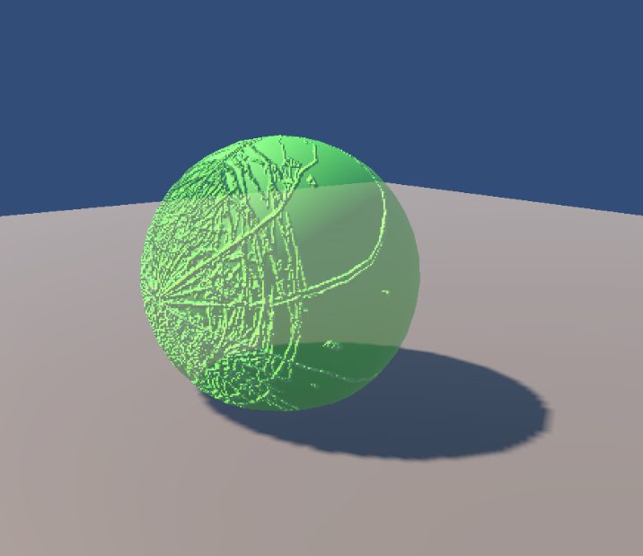
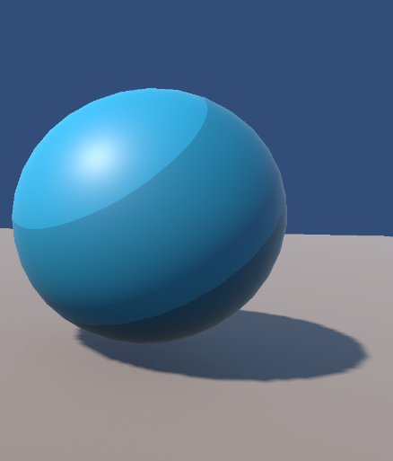

# Unity Shader Portfolio (URP)

Repositorio de shaders desarrollados en Unity (URP).

## Contenido

Actualmente el proyecto incluye los siguientes shaders:

### Plastic Scratched Shader

Shader de plástico translúcido con rayones superficiales.
Simula materiales tipo cápsula, combinando transparencia, variación de brillo y distorsión de fondo (fake refraction).

**Características:**

* Control de cantidad de rayones
* Variación de smoothness según desgaste
* Transparencia ajustable
* Efecto Fresnel para bordes
* Distorsión de fondo basada en normales

**Explicación completa:**
[Ver explicación más detallada](https://curly-billboard-7cb.notion.site/Pl-stico-rayado-3373ce3dafd6803a8397de39bc202894?pvs=73)

### Toon Shader

Shader de iluminación estilizada que crea un efecto tipo cartoon.

**Características:**

- Control del tamaño de las sombras (ShadowSize)
- Ajuste de contraste (Min / Max)
- Color base y textura opcional
- Iluminación no realista (NPR)

[Ver explicación más detallada](https://curly-billboard-7cb.notion.site/Toon-3573ce3dafd6805898dfcb1b4d0caa72?pvs=73)

## Notas

Este repositorio está en expansión.
Se irán añadiendo nuevos shaders.

